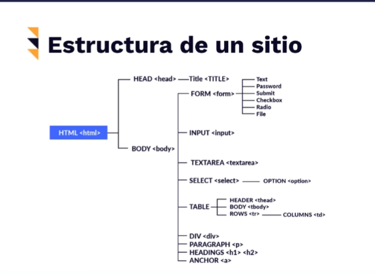

# Selenium con Python
## Historia


*¿Qué es Selenium?*

Es una **SUIT de herramientas** para la automatización de navegadores Web.

El objetivo de Selenium NO fue para el **Testing** ni para el **Web Scraping** (aunque se puede usar para eso), por lo tanto, no es el más optimo para estas actividades.

**Protocolo: WebDriver**, herramienta que se conecta a un API.

**Selenium WebDriver** es la herramienta que utilizaremos en el curso.

-Selenium NO es un Software, ES una SUIT de Softwares.

***DDT: Data Drive Testing:** Ingresar datos para que realice varias pruebas (sin intervención humana).

* Origen del Nombre:
Tenia la competencia de mercurial.
Dato curioso. Cuando una persona padece intoxicación por mercurio debe consumir suplementos en base se selenio para poderse
curar. Entonces el equipo considero una buena idea utilizar el nombre de selenio pues ellos ofrecían una “Cura” para lo que hacían
los competidores.

Selenium Web Driven
---
Pros

* Soporte para múltiples lenguajes
* Facil de instalar.
* Comunicación directa con el navegador.
* Interacción más realista.

Contra

* No soporta nuevos navegadores tan rápido.
* No genera reportes o resultados de pruebas.
* Requiere de saber programar.

## Otras herramientas
Algunas herramientas de testing y automatización:

Puppeteer:

• PROS: Soporte por parte de Google, te brinda datos del Performance Analysis de Chrome y un mayor control de este navegador. No requiere archivos externos como lo hace Selenium con WebDriver.

• CONTRAS: Solo funciona para Google Chrome con JavaScript, tiene una comunidad pequeña así que el apoyo será poco.

Cypress.io:

• PROS: Tiene una comunidad emergente y va creciendo a pasos acelerados, tiene muy buena documentación para implementar Cypress en los proyectos. Es muy ágil en pruebas E2E, está orientado a desarrolladores y tiene un excelente manejo del asincronismo, logrando que las esperas sean dinámicas y también se puedan manejar fácilmente.

• CONTRAS: Solo funciona en Google Chrome con JavaScript, se pueden realizar pruebas en paralelo únicamente en la versión de pago.

## Configurar entorno de trabajo

Instalar:
* Python
* Selenium
* PyUnitReport
**Nota** instalar dependencias en ambiente virtual

## Hola mundo!

### Cosas importantes de Unittest (PyTest)

* Test Fixture: preparaciones para antes y después de la prueba
* Test Case: unidad de código a probar
* Test Suite: colección de Test Cases
*Test Runner: orquestador de la ejecución
* Test Report: resumen de resultados
### Creando entorno virtual en python 3.8
1. Instalar: `sudo apt-get install python3.8-venv`
2. Ejecutar: `sudo python3.8 -m venv nombreDelProyecto`
3. Crear alias: `alias avenv="source venv/bin/activate"` (venv es el nombre del proyecto)
4. Ejecutar alias: `avenv`

Para instalar Chrome en Ubuntu 20.04
```
wget https://dl.google.com/linux/direct/google-chrome-stable_current_amd64.deb

sudo apt install ./google-chrome-stable_current_amd64.deb
```
**IMPORTANTE:** Para poder instalar con pip las librerías solamente en el entorno virutal de Python, hay que modificar el archivo “pyvenv.cfg”
```
home = /usr/bin
include-system-site-packages = true #!debe estar en true
version = 3.8.5
```

Si no deja modificar, ejecutar: 
```
sudo chown -r nombre_de_usuario directorio_del_proyecto
```
, en mi caso fue:
```
sudo chown -r mike_angel_rm /home/mike_angel_rm/personalProjects/CursoIntroduccionSeleniumPython
```
Apagamos el entorno virtual y lo volvemos a encender. Instalamos las librerías.

Si el código no funciona, esto funcionó para mí en WSL2:

hello_world.py:
```
import unittest
from pyunitreport import HTMLTestRunner
from selenium import webdriver
from selenium.webdriver.chrome.options import Options

class HelloWorld(unittest.TestCase):

  @classmethod
  def setUpClass(cls): # Qué es lo que se va a hacer
    options = Options()
    options.add_argument('--headless')
    options.add_argument('--no-sandbox')
    options.add_argument('--disable-dev-shm-usage')
    cls.driver = webdriver.Chrome(executable_path = '/usr/bin/chromedriver' , options=options) #Ruta de driver en unix
    driver = cls.driver # Para no tener que escribir self driver en cada línea
    #driver.implicity_wait(10)


  def test_hello_world(self):
    driver = self.driver
    driver.get('https://www.platzi.com')


  def test_visit_wikipedia(self):
    driver = self.driver
    driver.get('https://www.wikipedia.org')


  @classmethod
  def tearDownClass(cls):
    cls.driver.quit() # Cerramos la ventana del navegador después de cada prueba


if __name__ == '__main__':
  # output es el nombre del reporte
  unittest.main(verbosity=2 , testRunner= HTMLTestRunner(output = 'reportes', report_name='hello-world-report'))
```
Es importante tener chrome/chromium y chromedriver instalados en WSL2.

## Encontrar elementos con find_element
Estructura de HTML



En Selenium, podemos usar los selectores de las páginas web para llegar a los elementos, como son:

* ID
* Nombre del atributo
* Nombre de la clase
* Nombre de la etiqueta
* XPath -> Ruta de nodos en XML que indica la ubicación exacta de dónde se encuentra un elemento. NO es la mejor opción, pues los elementos de una página web pueden cambiar.
* Selector de CSS
* Texto del link
* Texto parcial del link

Podemos practicar en Madison Island

Instrucciones usadas en esta clase:

* `self.driver.find_element_by_id` -> Encontrar elemento por su ID
* `self.driver.find_element_by_name` -> Encontrar elemento por su name
* `self.driver.find_element_by_class_name` -> Encontrar elemento por nombre de clase CSS
* `find_elements_by_tag_name` -> Encontrar elementos por sus etiquetas HTML
* `self.driver.find_element_by_xpath` -> Encontrar elemento por su XPATH
* `self.driver.find_element_by_css_selector` -> Encontrar elemento por su selector CSS
Código de la clase (en WSL):

search_test.py
```
import unittest
from pyunitreport import HTMLTestRunner
from selenium import webdriver
from selenium.webdriver.chrome.options import Options


class HelloWorld(unittest.TestCase):

  @classmethod
  def setUpClass(cls):
    options = Options()
    options.add_argument('--headless')
    options.add_argument('--no-sandbox')
    options.add_argument('--disable-dev-shm-usage')
    cls.driver = webdriver.Chrome(executable_path = '/usr/bin/chromedriver' , options=options)
    driver = cls.driver
    driver.get('http://demo-store.seleniumacademy.com/')
    #driver.maximize_window()
    #driver.implicitly_wait(15) # segundos


  def test_search_text_fild(self):
    search_field = self.driver.find_element_by_id("search")


  def test_search_text_field_by_name(self):
    search_field = self.driver.find_element_by_name("q")


  def test_search_text_field_class_name(self):
    search_field = self.driver.find_element_by_class_name("input-text")


  def test_search_button_enabled(self):
    button = self.driver.find_element_by_class_name("button")


  def test_count_of_promo_banner_images(self):
    banner_list = self.driver.find_element_by_class_name("promos") #Buscamos la clase "promos"
    banners = banner_list.find_elements_by_tag_name("img") #Buscamos las etiquetas img dentro de promos
    self.assertEqual(3, len(banners)) #Hacemos una assertion para ver si efectivamente es la cantidad de imágenes que esperamos
    #! NO son 3 imágenes, son 4, pero recordemos que se cuenta: [0,1,2,3]


  def test_vip_promo(self):
    vip_promo = self.driver.find_element_by_xpath('//*[@id="top"]/body/div/div[2]/div[2]/div/div/div[2]/div[1]/ul/li[4]/a/img')


  def test_shopping_cart(self):
    shopping_cart_icon = self.driver.find_element_by_css_selector("div.header-minicart span.icon")


  @classmethod
  def tearDownClass(cls):
    cls.driver.quit()


if __name__ == '__main__':
  unittest.main(verbosity = 2)
  ```