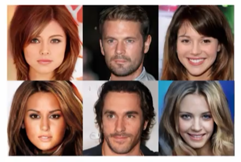
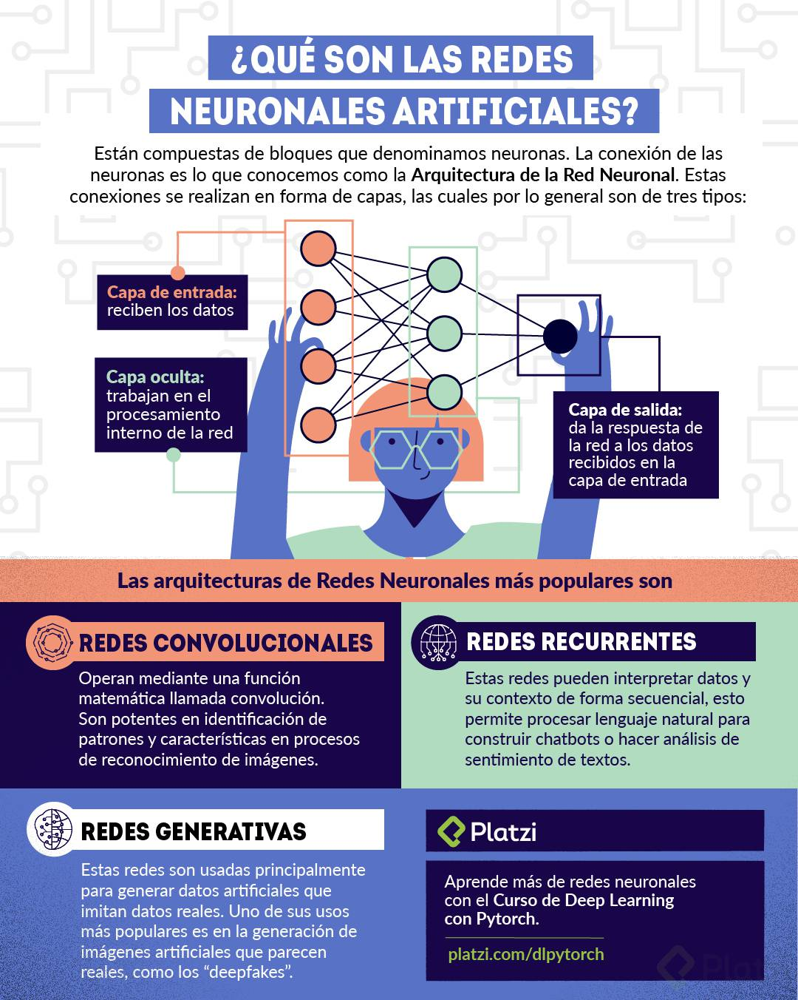

**Curso de Deep Learning con Pytorch**
---


# Conceptos Inciales de Deep Learning

---
## ¿Qué es Deep Learning?

Es una área del Machine Learning que usa **redes neuronales de más de una capa**, para **aprender automáticamente features** de distintos niveles de abstracción, y resolver problemas difíciles de datos, como: imagen, texto, video, audio.

### Historia


El deep learning no es reciente, esto empezó desde 1950, pero el boom surgió en 2010, esto debido a que en ciertos hackaton, como el que usaba el CIFAR10, empiezan a utilizarse redes profundas, con esto la presición de los algoritmos crecieron rapidamente.

* **1950-1990:** Creación de algotimos principales para entrenamiento de NNs
* **1990:** Dificultades para entrenar modelos profundos + Investigación
* **2010 > :** Explosión del Deep Learning
* 
### Logros

* Resolución con performance casi humana de una gran parte de las tareas de percepción:    
  * Visión: detección de objetos, segmentación semántica
  * Escucha: Speech-to-text, reproducción de sonidos
  * Lenguaje: Traducción automática
  * Juegos: Ajedrez, Go, Lol, SC2
* Cada vez impactando más campos, como la física ([ejemplo](https://arxiv.org/abs/1912.08245)), la medicina y las finanzas
* El premio turing 2018 fue entregado a tres de los princpales contibuidores del DL

### Aplicaciones
DL Generativo
---
Cómo generar imagenes artificialmente:



MusicVAE
---
 Dando dos pequeños loops el algoritmo hace una canción. [enlace](https://www.youtube.com/watch?v=G5JT16flZwM&ab_channel=Magenta)

 Pix2Pix
 ---
Hacinedo un bosquejo, el algoritmo lo convierte en un imagen real. enlace [https://affinelayer.com/pixsrv/]

CycleGAN
---
Este es el proyecto que se va a realizar. Este algoritmo hace transferencia de estilo en las imágenes. [enlace](https://junyanz.github.io/CycleGAN/)


---
## ¿Qué son las redes neuronales artificiales?




---
## ¿Por qué el Deep Learning ahora?


¿Qué cambio para que el Deep Learning se popularice ta rápido?
- Datasets labelizados de gran tamaño: Estos son los datasets etiquetados que sirve para clasificar imagenes, diferentes plataformas ofrecen un gran tamaño de datasets de manera gratuita.
- GPUs y Hardware: Las GPUs paralelizan el trabajo del Deep Learning mejorando el tiempo de ejecución.
- Mejora en los algoritmos: Cada vez salen más mejoras en los algoritmos para hacer más eficientes los modelos.
- Software Open Source: Los más populares Tensorflow, Pytorch, Keras, Theano, entre otros.

---
## Pytorch y los diferentes frameworks de Deep Learning


Pytorch versus otros frameworks de Deep Learning
Una red neuronal se implementa gracias a un grafo de cómputo, un grafo de cómputo son varias operaciones hechas de manera secuencial.
- TersorFlow: En tersorFlow la codificación es más larga, utiliza grafos de cómputo estáticos y una vez que se crea el grafo y se ejecuta el entrenamiento es muy difícil modificar la estructura de este grafo.
- Pytorch: En pytorch la codificación es más corta, utiliza grafos de cómputo dinámico y una vez que se crea el grafo en cada corrida de entrenamiento este puede cambiar y por esto es más flexible para diferentes modelos de Deep learning.

---
## Setup en Google Colab

Puedes ver el setup en este [notebook], recueda que tienes que poner la ruta que quieras definir.

Puedes ver más sobre los Magic Command que se usan con % [aquí](https://platzi.com/tutoriales/1794-pandas/6960-ipython-magics-commands/).


# Entender la API de Pytorch
---
## ¿Qué son los tensores?

En matemáticas y en física, un tensor es cierta clase de entidad algebraica de varios componentes que generaliza los conceptos de escalar, vector y matriz de una manera que sea independiente de cualquier sistema de coordenadas elegido.

Aquí un extracto de la [documentación](https://pytorch.org/tutorials/beginner/basics/tensorqs_tutorial.html) de [pytorch](https://pytorch.org/tutorials/beginner/former_torchies/tensor_tutorial.html):

Creación de un tensor de tamaño (5 x 7) sin inicialización de memoria:
```
import torch
a = torch.empty(5, 7, dtype=torch.float)
```

Inicializar un tensor randomizado con una distribución normal:
```
a = torch.randn(5, 7, dtype=torch.double)
print(a)
print(a.size())
```

Los tensores se pueden trabajar en la GPU, por defecto pytorch los crea para trabajar con la CPU. Para esto primero verificamos que tengamos una GPU
con el comando `torch.cuda.is_available()`

Ejemplo de la documentación:
```
# let us run this cell only if CUDA is available
if torch.cuda.is_available():

    # creates a LongTensor and transfers it
    # to GPU as torch.cuda.LongTensor
    a = torch.full((10,), 3, device=torch.device("cuda"))
    print(type(a))
    b = a.to(torch.device("cpu"))
    # transfers it to CPU, back to
    # being a torch.LongTensor
```

---
## Tensores y datasets
La librería torch.vision permite trabajar con imágenes, además trae muchos data sets, algunos muy famosos, como: ImageNet, Coco, MNIST.

En el notebook [Tensores]() se muestran estos datasets y su descarga

También es bueno revisar la [documentación](https://pytorch.org/tutorials/beginner/basics/data_tutorial.html)

---
## Capas de una red neuronal en Pytorch

Las capas de las redes neuronales son una función, transforman un x en un y.

Para crear redes neuronales en pytorch debemos llamar el modulo `torch.nn`, este modulo tiene varias redes y capas, tales como: 
* Linear: tiene dos argumentos, el tamaño del tensor de entrada y el tamaño del tensor de salida, esto va a hacer una trasnformación de volúmenes. Esta capa solo admite tensores de dimensión 1-d. En sí podria definirse como una transformación  lineal. Tambien es llamada fully conected (fc).
* Conv2D: se usa para imágenes, tiene como argumentos, los canales de entrada, los canales de salida, el tamaño de kernal, stride, padding. 
* Conv3D: para video
* ReLU: rectified linear unit, 

El código para crearlas sería así:
```

import torch
import torch.nn as nn

linear = nn.Linear(in_features=4096, out_features=10) # tensores de dim 1 input
conv = nn.Conv2d(in_channels=3, out_channels=9, kernel_size=3, stride=1, padding=1) #modificar los canales, no va a modificar
relu = nn.ReLU(False)
```

Estas redes tiene los parámetros de pesos y bias para hacer las predicciones

---
## Crear una red neuronal en Pytorch

Las redes neuronales se crean como subclases del modulo `torch.nn`, además algunas capas que no tienen parámetros se pueden solo llamar como funciones con el modulo `torch.nn.funtional`, por ejemplo ReLU, maxpool. 

La red como subclase, además necesita dos metodos:
* Uno de inicialización `__init__`, aquí se inicialización todas las capas a utilizar
* y otro de forward que es donde crearemos la estructura de las capas.

Al ser una subclase se debe inicializar la clase padre con `super().__init__()` y los parámetros que ingresemos se deben definir como atributo.

```
class Net(nn.Module): # Se crea la clase con herencia
  def __init__(self, num_channels): #Se inicializa junto con los parametros
    super(Net,self).__init__() # se inicizaliza la clase padre
    
    self.num_channels = num_channels # se define el parámetro como atributo.
```

Definimos las capas, de las cuales, recordemos que las iniciales son extractoras de features (eg. Conv) y las siguientes lineales (eg.fully conected). 

El ejemplo llevará 5 capas, 3 convolucionales y dos lineales. Los datos con los que se trabajará serán imágenes de una mano indicando números con los dedos (eg. :ok_hand: = 0, :point_up: = 1, :v: = 2, etc), por esto y como se vió el la parte se setup, estas imagenes son de 64x64 pixles y tienen 3 canales al tener color, esto es uno de los parámetros que se deben definir en la definicion de la capa convolucional, también debe ir el numero de canales de salida, en nuestro caso será `num_channels` para la primera capa convolucional, para la segunda los canales de entrada será la salida de la anterior, es decir `num_channels`, y la salida un multiplo de la misma, y lo mismo en la tercera. Así:

```
    self.conv1 = nn.Conv2d(3, self.num_channels, 3, stride = 1, padding = 1)
    self.conv2 = nn.Conv2d(self.num_channels, self.num_channels*2, 3, stride = 1, padding = 1)
    self.conv3 = nn.Conv2d(self.num_channels*2, self.num_channels*4, 3, stride = 1, padding = 1)
```

Despues de cada aplicación de una capa convolucional es necesario reducir su tamaño, esto se hace con una capa maxpool, que podemos llamar directamente del modulo (nn.funtional). Esta se pone en el metodo forward. En este método  es **super importante** hacer un seguimiento al tamaño del tensor. Esta parte quedaría así:

```
    def forward(self,x):
      #Empieza 3x64x64
      x = self.conv1(x) # num_channels x 64 x 64
      x = F.relu(F.max_pool2d(x, 2)) # num_channels x 32 x 32
      x = self.conv2(x) # num_channels*2 x 32 x32
      x = F.relu(F.max_pool2d(x, 2)) #num_channels*2 x 16 x 16
      x = self.conv3(x) # num_channels*4 x16x16
      x = F.relu(F.max_pool2d(x, 2)) # num_channels*4 x 8 x 8
```

Con la información del tamaño de la salida de las capas convolucionales, ya podemos definir las capas lineales (fully conected), tambien se define la salida de la capa lineal. enl a primera lineal daremos un número arbitrario y en la segunda la salida serán las clases que nos interesan, para nuestro caso serán 6, pues solo podemos hacer 6 números con una mano. Estás deben ser inicializadas. Las dos capas lineales quedarían así: 

```
    self.fc1 = nn.Linear(self.num_channels*4*8*8, self.num_channels*4)
    self.fc2 = nn-Linear(self.num_channels*4, 6)
```

Como las capas lineales toman tensores de dimención 1, antes de implementarlas en el metodo forward, debemos hacer un flatten. Esto lo hacemos con el método `view`, como el parámetro -1 indicamos que harémos flatten, y le damos el tamaño del tensor, así `x = x.view(-1, self.num_channels*4*8*8)`.

La salida final se hará con softmax que nos permite tener probabilidades multiclase. 

La red neuranal quedaría así:
```
class Net(nn.Module): # Se crea la clase con herencia
  def __init__(self, num_channels): #Se inicializa junto con los parametros
    super(Net,self).__init__() # se inicizaliza la clase padre
    
    self.num_channels = num_channels # se define el parámetro como atributo.
    
    self.conv1 = nn.Conv2d(3, self.num_channels, 3, stride = 1, padding = 1)
    self.conv2 = nn.Conv2d(self.num_channels, self.num_channels*2, 3, stride = 1, padding = 1)
    self.conv3 = nn.Conv2d(self.num_channels*2, self.num_channels*4, 3, stride = 1, padding = 1)
    
    self.fc1 = nn.Linear(self.num_channels*4*8*8, self.num_channels*4)
    self.fc2 = nn-Linear(self.num_channels*4, 6)
  
    def forward(self,x):
      #Empieza 3x64x64
      x = self.conv1(x) # num_channels x 64 x 64
      x = F.relu(F.max_pool2d(x, 2)) # num_channels x 32 x 32
      x = self.conv2(x) # num_channels*2 x 32 x32
      x = F.relu(F.max_pool2d(x, 2)) #num_channels*2 x 16 x 16
      x = self.conv3(x) # num_channels*4 x16x16
      x = F.relu(F.max_pool2d(x, 2)) # num_channels*4 x 8 x 8
      
      #flatten
      x = x.view(-1, self.num_channels*4*8*8)
      
      #fc
      x = self.fc1(x)
      x = F.relu(x)
      x = self.fc2(x)
      
      #log_softmax
      
      x = F.log_softmax(x, dim=1)
      
      return x
```
---
## ¿Cómo cargar datos en Pytorch?
En Pytorch los dataset se deben definir como clases y estos deben implemetar tres funciones: : `__init__`, `__len__`, y `__getitem__`.  ([Ver documentación](https://pytorch.org/tutorials/beginner/basics/data_tutorial.html)) 

* `__init__` en esta función se inicializa el objeto, se define la ruta del dataset, y las tranformaciones.

* `__len__` devuelve el número de muestras del dataset

* `__getitem__` regresa una muestra con un determinado indice. Esta función coge la imagen, la convierte en tensor, toma la etiqueta que tenga, aplica la transformación que tenga definida la clase y luego devulte el tensor-imagen con la etiqueta correspondiente en un tupla.

```
Comentario de la clase:

Pytorch maneja 2 distintos tipos de datasets, que pueden ser cargados por el método Dataloader.

**MAP STYLE DATASET**
Es el que implementa los protocolos getitem() y len(), y pueden ser mapeados mediante un mapeo indice/clave.

**ITERABLE STYLE DATASET**
Es una instancia de la subclase de IterableDataset que implementa el protocolo iter() y representa un iterable sobre la muestra de datos.

Este tipo de datasets seusa en casos en los cuáles las lecturas aleatorias son caras o incluso improbables y el tamaño del lote depende de los datos obtenidos

Este dataset, si es llamado iter(dataset), podría devolver un flujo de lectura de datos de una base de datos, un servidor remoto o incluso registros generados en tiempo real.
```

Nuestra clase para importar el dataset quedaría así (recordemos que estamos trabajando con los folder de google drive):
```
import os
from PIL import Image # Lo usamos para cargar las imagenes en __getitem__
from torch.utils.data import Dataset # Debemos importar la clase padre Dataset

# Creamos la clase para cargar nuestros datos
class SIGNSDataset(Dataset):
  "Ejemplo de como construir un dataset de imagenes"
  def __init__(self, base_dir, split="train", transform=None):
    # split se debe a que tenemos tres grupos de imagenes en tres carpetas diferentes.
    path = os.path.join(base_dir, "{}_signs".format(split)) # Aquí swicheamos al set que queramos
    files = os.listdir(path) 
    self.filenames = [os.path.join(path, f) for f in files if f.endswith(".jpg")] # Aquí definimos que solo escogemos los archivos terminados en jpg
    
    # Para nuestro caso, el primer caracter del nombre de las imagenes corresponden a las etiquetas
    self.targets = [int(f[0]) for f in files]
    self.transform = transform
    
  def __len__(self):
    return len(self.filenames)
  
  def __getitem__(self, idx):
    image = Image.open(self.filenames[idx]) 
    if self.transform:
      image = self.transform(image)
    return image, self.targets[idx]


# Importamos los datos
signs = SIGNSDataset('./datasets/64x64_SIGNS')
```

---
## ¿Cómo entrenar una red en Pytorch?

Vamos a volver a importar nuestros datos, esta vez transformandolos a tensores, para esto se debe llamar a el modulo `torchvision.transforms`, y queraría así:

```
import torchvision.transforms as transforms

trainset = SIGNSDataset('./datasets/64x64_SIGNS',transform=transforms.ToTensor())
```

### DataLoader
La clase `Dataset` importa las features y etiquetas una muestra a la vez. Mientras entrenamos un modelo, normalmente queremos pasar muestras en "minibatches", reorganizar los datos en cada época para reducir el sobreajuste del modelo y usar el multiprocesamiento de Python para acelerar la recuperación de datos.

`DataLoader` es un iterable que nos abstrae esta complejidad en una API sencilla.

Para nuesto caso sería así:
```
from torch.utils.data import DataLoader
dataloader = DataLoader(trainset,batch_size=32)
```

### Entrenamiento

Para el entrenamiento vamos a necesitar llamar al optimizador de los parámetros de la red con `torch.optim`. Debemos definir el dispositivo de entreamiento, si es GPU sería `device='cuda'`. Debemos instanciarla red neuroral y pasarla al dispotivo GPU, y definir la función de perdida que da el error.

```
device = "cuda" if torch.cuda.is_available() else "cpu"
print("Using {} device".format(device)) 

import torch.optim as optim # importamos para definir el optimizador de los parámetros de la red neuronal

net = Net(32).to(device) # Pasamos la red para trabajar con la GPU

loss_fn = nn.NLLLoss() # La función de perdida nos va a mostrar el 'error'
optimizer = optim.SGD(net.parameters(), lr=1e-3, momentum = 0.9) # Creamos el optimizador
```

**Loop de [Entrenamiento](https://pytorch.org/tutorials/beginner/basics/optimization_tutorial.html)**
Debemos definir otro hiperparametro llamado epoch o épocas, el numero de épocas es el numero de veces que vamos a iterar sobre el dataset, es decir cada iteración será una época (epoch).

Cada época consiste en dos partes principales, loop de entrenamiento, en el que se tratan de encontrar los parámetros optimos para la red y loop de validación donde se verfiva que el desempeño del modelo esté mejorando. 

Dentro del loop de entranamiento, la optimización pasa en tres pasos:
* Se llama la función `optimizer.zero_grad()` para restablecer los gradientes de los parámetros del modelo. Los gradientes se suman por defecto; para evitar el doble conteo, los ponemos a cero explícitamente en cada iteración.

* Se propaga la pérdida de la predicción llamando la función `loss.backwards()` 

* Una vez que tenemos nuestros gradientes, llamamos la función `optimizer.step()` para ajustar los parámetros por los gradientes recolectados en el paso anterior.

El loop que se implementó en la clase quedó así:
```
num_epochs = 100

for epoch in range(num_epochs):
  print('Epoch {}/{}'.format(epoch+1, num_epochs))
  print('-'*10)
  
  running_loss = RunningMetric() # perdida
  running_acc = RunningMetric() #precision
  
  for inputs, targets in dataloader: # Cargamos las imagenes en batches con Dataloader
    inputs, targets = inputs.to(device), targets.to(device) # llevamos los elementos a la GPU
    optimizer.zero_grad() # Reinicia los grandientes a 0
    
    outputs = net(inputs) # Pasamos la imagenes por la red
    _, preds = torch.max(outputs,1) # Miramos el valor predicho, que será el valor máximo de output
    loss = loss_fn(outputs, targets) # Comparamos los valores reales con los predichos
    
    loss.backward() #magias: gradientes calculados automaticamente
    optimizer.step() #magia2: actualiza las perillas o los parametros
    
    batch_size = inputs.size()[0]
    running_loss.update(loss.item()*batch_size,
                       batch_size) # Usamos la función auxiliar que definimos antes para caluclar la perdida
    running_acc.update(torch.sum(preds == targets).float(),
                       batch_size) # Usamos la función auxiliar para calcular la presición
  print("Loss: {:.4f} Acc: {:.4f} ".format(running_loss(),
                                          running_acc()))
```

**Guardar el modelo**

Si quieren guardar sus modelos entrenados para servirlos en una App para que los consuma u otras cosas, pueden usar este codigo:

* Para guardar el modelo
`torch.save(net.state_dict(), PATH)`

* Para cargar el modelo
`net.load_state_dict(torch.load('./metal_defects/best_model.pt'))`

Más información en este [link](https://pytorch.org/tutorials/beginner/saving_loading_models.html)

# Entrenar Redes Neuronales Profundas

## Ciclo de trabajo para el Deep Learning