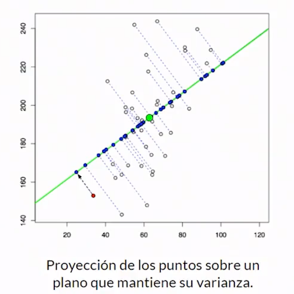
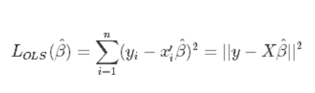
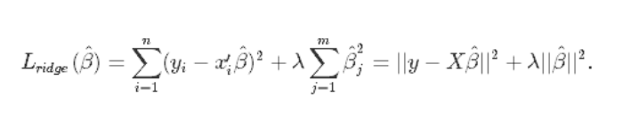
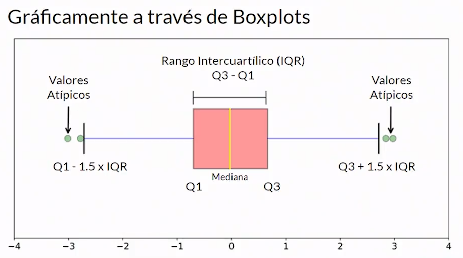
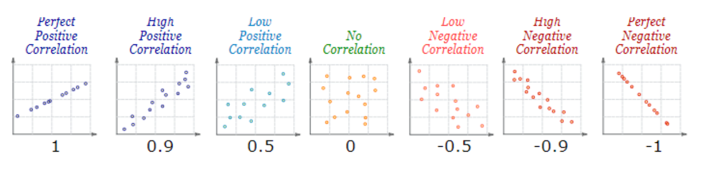

# Curso PRO de ML con Scikit Learn

# Clase 1: ¿Por qué usar Scikit-learn?

- Curva de aprendizaje suave.
- Es una biblioteca muy versátil.
- Comunidad de soporte.
- Uso en producción.
- Integración con librerías externas.

# Clase 2: **¿Cómo aprenden las maquinas?**

Las maquinas aprenden de datos. Desde el punto de vista de los datos, podemos aplicar tres técnicas según la naturaleza y disponibilidad de los mismos:

- Aprendizaje supervisado: Algoritmo por observación.
- Aprendizaje no supervisado: Algoritmo por prueba y error.
- Aprendizaje por refuerzo: Algoritmo por descubrimiento.

# Clase 3: Problemas que podemos resolver con Scikit-learn.

**Algunas limitaciones de Scikit-learn**

1- No es una herramienta de Computer Vision.

2.- No se puede correr en GPUs.

3.- No es una herramienta de estadística avanzada.4.- No es muy flexible en temas de Deep Learning.

**Qué problemas podemos abordar con Scikit-learn?**

- Clasificaciones: Necesitamos etiquetar nuestros datos para que encajen en alguna de ciertas categorías previamente definidas.Ejemplos: ¿Es cáncer o no es cáncer?, ¿La imagen pertenece a un Ave, Perro o Gato?, ¿A qué segmento de clientes pertenece determinado usuario?
- Regresión: Cuando necesitamos modelar el comportamiento de una variable continua, dadas otras variables correlaciones.Ejemplos: Predecir el precio del dólar para el mes siguiente, el total de calorías de una comida dados sus ingredientes, la ubicación más probable de determinado objeto dentro de una imagen.
- Clustering: Queremos descubrir subconjuntos de datos similares dentro del dataset. Queremos encontrar valores que se salen del comportamiento global.Ejemplo: Identificar productos similares para un sistema de recomendación, descubrir el sitio ideal para ubicar paradas de buses según la densidad poblacional, segmentar imágenes según patrones de colores y geometrías.

# Clase 4: Las matemáticas que vamos a necesitar

**Importancia de las mates en el ML**

**La cortina de fondo:** Varias técnicas que usamos para que los computadores aprendan están inspiradas en el mundo natural.

- Redes neuronales artificiales: Están inspiradas en el cerebro humano.
- Aprendizaje por refuerzo: Está inspirado en las teorías de la psicología conductual.
- Algoritmos evolutivos: Los teorías de Charles Darwin.

**Temas matemáticos generales a repasar:**

- Funciones y trigonométrica.
- Algebra lineal.
- Optimización de funciones.
- Calculo diferencial.

T**emas de probabilidad a repasar**

- Probabilidad básica.
- Combinaciones y permutaciones.
- Variables aleatorias y distribuciones.
- Teorema de Bayes.
- Pruebas estadísticas.

# Clase 6: Instalación de liberías en Python.

---

Otra forma de comprobar que este instalado correctamente y la versión de la biblioteca es con el comando: python -m pip show Nombre_Del Paquete

Y para comprobar o simplemente listar los paquetes de nuestro entorno virtual es con: pip freeze , o con: pip list

# Datasets que usaremos en el curso.

**Datasets que usaremos en el curso:**

- [World Happiness Report](https://www.kaggle.com/unsdsn/world-happiness): Es un dataset que desde el 2012 recolecta variables sobre diferentes países y las relaciona con el nivel de felicidad de sus habitantes. *Nota: Este data set lo vamos a utilizar para temas de regresiones*
- [The Ultimate Halloween Candy Power Ranking](https://www.kaggle.com/fivethirtyeight/the-ultimate-halloween-candy-power-ranking): Es un estudio online de 269 mil votos de más de 8371 IPs deferentes. Para 85 tipos de dulces diferentes se evaluaron tanto características del dulce como la opinión y satisfacción para generar comparaciones. *Nota: Este dataset lo vamos a utilizar para temas de clustering*
- [Heart disease prediction](https://www.kaggle.com/c/SAheart): Es un subconjunto de variables de un estudio que realizado en 1988 en diferentes regiones del planeta para predecir el riesgo a sufrir una enfermedad relacionada con el corazón. *Nota: Este data set lo vamos a utilizar para temas de clasificación.*

# **¿Cómo afectan nuestros features a los modelos de Machine Learning?**

- ¿Qué son los features? Son los atributos de nuestro modelo que usamos para realizar una interferencia o predicción. Son las variables de entrada.

---

**Más features simpre es mejor, ¿verdad?**

*La respuesta corta es: NO.* En realidad si tenemos variables que son irrelevantes pasarán estas cosas:

- Se le abrirá el paso al ruido.
- Aumentará el costo computacional.
- Si introducimos demasiados features y estos tienen valores faltantes, se harán sesgos muy significativos y vamos a perder esa capacidad de predicción.

*Nota: Hacer una buena selección de nuestro features, hará que nuestros algoritmos corran de una manera mas eficiente.*

---

**Una de las formas de saber que nuestros features han sido bien seleccionados es con el sesgo y la varianza.**

- Una mala selección de nuestro features nos puede llevar a alguno de esos dos escenarios indeseados.

---

**Algo que debemos que recordar es que nuestro modelo de ML puede caer en uno de 2 escenarios que debemos evitar:**

- Uno es el Underfitting: Significa que nuestro modelo es demasiado simple, en donde nuestro modelo no está captando los features y nuestra variable de salida, por lo cual debemos de investigar variables con mas significado o combinaciones o transformaciones para poder llegar a nuestra variable de salida.
- Por otro lado está el Overfitting: Significa que nuestro modelo es demasiado complejo y nuestro algoritmo va a intentar ajustarse a los datos que tenemos, pero no se va a comportar bien con los datos del mundo real. Si tenemos overfiting lo mejor es intentar seleccionar los features de una manera mas critica descartando aquellos que no aporten información o combinando algunos quedándonos con la información que verdaderamente importa.

---

**¿Qué podemos hacer para solucionar estos problemas?**

- Aplicar técnicas reducción de la dimensionalidad. Utilizaremos el algoritmo de PCA.
- Aplicar la técnica de la regulación, que consiste en penalizar aquellos features que no le estén aportando o que le estén restando información a nuestro modelo.
- Balanceo: Se utilizará Oversampling y Undersampling en problemas de rendimiento donde tengamos un conjunto de datos que está desbalanceado, por ejemplo en un problema de clasificación donde tenemos muchos ejemplos de una categoría y muy pocos de otra.

# Clase 9: **Introducción al algoritmo PCA (Principal Component Analysis)**

---

**¿Por qué usaríamos este algoritmo?**

- Porque en machine learning es normal encontrarnos con problemas donde tengamos una enorme cantidad de features en donde hay relaciones complejas entre ellos y con la variable que queremos predecir.

Pistas donde se puede utilizar un algoritmo PCA:

- Nuestro dataset tiene un número alto de features y no todos sean significativos.
- Hay una alta correlación entre los features.
- Cuando hay overfiting.
- Cuando implica un alto coste computacional.

---

**¿En que consiste el algoritmo PCA?**

Básicamente consiste en reducir la complejidad del problema:

**1.-** Seleccionando solamente las variables relevantes.

**2.-** Combinándolas en nuevas variables que mantengan la información más importante (varianza de los features).

---

**¿Cuales son pasos para llevar a cabo el algoritmo PCA?**

**1.-** Calculamos la matriz de covarianza para expresar las relaciones entre nuestro features.

**2.-** Hallamos los vectores propios y valores propios de esta matriz, para medir la fuerza y variabilidad de estas relaciones.

**3.-** Ordenamos y escogemos los vectores propios con mayor variabilidad, esto es, aportan más información.

---

**¿Qué hacer si tenemos una PC de bajos recursos?**

- Si tenemos un dataset demasiado exigente, podemos usar una variación como IPCA.
- Si nuestros datos no tienen una estructura separable linealmente, y encontramos un KERNEL que pueda mapearlos podemos usar KPCA.

# Clase 12. Kernels y KPCA

**Ahora que ya sabemos el algoritmo de PCA, ¿que otras alternativas tenemos?**

---

Bueno, una alternativa son los Kernels. Un Kernel es una función matemática que toma mediciones que se comportan de manera no lineal y las proyecta en un espacio dimensional más grande en donde son linealmente separables.

**Y, ¿esto para que puede servir?**

Sirve para casos en donde no son linealmente separables. El la primera imagen no es posible separarlos con una linea y en la imagen 2 si lo podemos hacer mediante Kernels. Lo que hace la función de Kernels es proyectar los puntos en otra dimensión y así volver los datos linealmente separables.

**¿Que tipo de funciones para Kernels nos podemos encontrar?**

**Ejemplos de funciones de Kernels en datasets aplicados a un clasificador:**

# Clase 13. ¿Qué es la regularización y cómo aplicarla?

Esta técnica consiste en disminuir la complejidad de nuestro modelo a través de una penalización aplicada a sus variables más irrelevantes.

Como podemos apreciar en la gráfica 1, hay un sub ajuste, ya que la linea roja se acopla muy bien para los datos de prueba, pero no para los datos de entrenamiento. La linea roja en los datos de prueba da una mala generalización, una mala aproximación.
Entonces, la regularización consiste en introducir un poco de sesgo para reducir la varianza de los datos.

Pero para poder aplicar regularización necesitamos un termino adicional el concepto de perdida. El concepto de perdida nos dice que tan lejos están nuestras predicciones de los datos reales, esto quiere decir que entre menor sea la perdida mejor será nuestro modelo.

Como podemos ver en la gráfica que la perdida tiende a disminuir, porque en algún momento van a ser vistos, van a ser operados y el modelo va a tender a ajustarse a esos datos de entrenamiento, pero lo que tenemos que mirar es cómo se va a comportar en el mundo real. En el conjunto de validación o pruebas es muy normal que nuestra perdida comience a disminuir porque hay una buena generalización, pero llega un punto donde nuevos valores comienza a introducirse donde esa perdida vuelve a comenzar a subir ese es el punto donde en general se considera que comienza a haber sobreajuste. Es la perdida la medida que vamos a utilizar para poder utilizar la regularización.

## ¿Cuántos tipos de regularización existen?

- **L1 Lasso:** Reducir la complejidad a través de eliminación de features que no aportan demasiado al modelo.
Penaliza a los features que aporta poca información volviéndolos cero, eliminado el ruido que producen en el modelo.

- **L2 Ridge:** Reducir la complejidad disminuyendo el impacto de ciertos features a nuestro modelo.
Penaliza los features poco relevantes, pero no los vuelve cero. Solamente limita la información que aportan a nuestro modelo.

- **ElasticNet:** Es una combinación de las dos anteriores.

## Lasso vs Ridge.

1.- No hay un campeón definitivo para todos los problemas.
2.- Si hay pocos features que se relacionen directamente con la variable a predecir: Probar Lasso.
3.- Si hay varios features relacionados con la variable a predecir: Probar Ridge.

# Clase 16: ElasticNet.

## ElasticNet: Una técnica intermedia:

Hasta el momento hemos podido ver dos técnicas de regularización en las cuales añadimos un componente de penalización en el proceso donde encontramos los valores de los parámetros 𝛽 minimizando la función de error.

Por ejemplo, si usamos el método de Mínimos Cuadrados Ordinarios, tenemos por definición nuestra función definida como:

Ahora bien. Si aplicamos la regularización L1 también conocida como Lasso (Least Absolute Shrinkage and Selection Operator), tenemos una ecuación de la forma:

donde tenemos un parámetro de ajuste llamado ƛ que si tiene valores altos para el problema mandará el valor de 𝛽j a 0.

Por otro lado. Si aplicamos la regularización L2 también conocida como Ridge, tendremos la siguiente ecuación:

Tendremos una penalización también pero que no tiene la posibilidad de llevar los valores de los coeficientes a cero. Sin embargo esto nos permitirá realizar el intercambio de +sesgo por -varianza.

Recordando que:

1. Ninguna de las dos es mejor que la otra para todos los casos.
2. Lasso envía algunos coeficientes a cero permitiendo así seleccionar variables significativas para el modelo.
3. Lasso funciona mejor si tenemos pocos predictores que influyen sobre el modelo.
4. Ridge funciona mejor si es el caso contrario y tenemos una gran cantidad.

Para aplicarlos y decidir cuál es el mejor en la práctica, podemos probar usando alguna técnica como cross-validation iterativamente. o bien, podemos combinarlos…

# Clase 17: El problema de los valores atípicos

- Un valor atípico es cualquier medición que se encuentre por fuera del comportamiento general de una muestra de datos.
- Pueden indicar variabilidad, errores de medición o novedades.

### ¿Por qué son problemáticos?

1.- Pueden generar sesgos importantes en los modelos de ML. 

2.- A veces contienen información relevante sobre la naturaleza de los datos. 

3.- Detección temprana de fallos. 

### ¿Cómo identificarlos?

A través de métodos estadísticos: 

1. Z - Score: Mide la distancia (en desviaciones estándar) de un punto dado a la media. 
2. Técnicas de clustering como DBSCAN. 
3. Si q< Q1-1.5*IQR ó q > Q3+1.5*IQR 

- **DBSCAN:** **Density-Based Spatial Clustering of Applications with Noise.**

Consiste en considerar a zonas muy densas como clusters, mientras que los puntos que carecen de ‘vecinos’ no pertenecen a ningún conjunto y por lo tanto se clasifican como ruido (o outliers).

Una ventaja de está técnica es que no se requiere que se especifique el número de clusters (como en K-means, por ejemplo), en cambio se debe especificar un número mínimo de datos que constituye un cluster y un parámetro epsilon que está relacionado con el espacio entre vecinos.

En la siguiente imagen pueden ver un ejemplo gráfico de esta técnica:

Mas información en:

[https://dashee87.github.io/data science/general/Clustering-with-Scikit-with-GIFs/](https://dashee87.github.io/data%20science/general/Clustering-with-Scikit-with-GIFs/)

En este artículo se explica por que se toma el valor 1.5*IQR para calcular los valores atípicos:

[https://towardsdatascience.com/why-1-5-in-iqr-method-of-outlier-detection-5d07fdc82097](https://towardsdatascience.com/why-1-5-in-iqr-method-of-outlier-detection-5d07fdc82097)

# Clase 18: Regresiones robustas en Scikit-learn

- **Ransac:** selecciona una muestra aleatoria de los datos asumiendo que esa muestra se encuentra dentro de los valores inliners, con estos datos se entrena el modelo y se compara su comportamiento con respecto a los otros datos. Este procedimiento se repite tantas veces como se indique y al finalizar el algoritmo escoge la combinación de datos que tenga la mejor cantidad de inliners, donde los valores atípicos puedan ser discriminados de forma efectiva.

**Ejemplo:**

- **Huber Regresor**: no elimina los valores atípicos sino que los penaliza. Realiza el entrenamiento y si el error absoluto de la perdida alcanza cierto umbral (epsilon) los datos son tratados como atípicos. El valor por defecto de epsilon es 1.35 ya que se ha demostrado que logra un 95% de eficiencia estadística.

# Clase 21: Métodos de ensamble.

1. Combinar diferentes métodos de ML con diferentes configuraciones y aplicar un método para lograr un consenso.  
2. La diversidad es muy buena opción. 
3. Los métodos de ensamble se ha destacada por ganar muchas competencias de ML. 

### 2 estrategias para casi todos los casos que se pueden representar:

### 1. Bagging:

¿Qué tal si en lugar de depender de la opinión de un solo "experto" consultamos la opinión de varios expertos en paralelo e intentamos lograr un consenso? 

Para ello nos tenemos que imaginar que nuestro modelo de ML es un experto, pero, ¿si pudiéramos tener la opinión de varios expertos? Pues sería mucho mejor, ¿verdad? Entonces, en este algoritmo se toma en consideración varios votos de expertos y para ello se puede hacer un conteo o simplemente un promedio.

### Pasos:

- Paso 1: Primero vamos a crear particiones uniformes de todo nuestro dataset y teniendo en cuenta que dentro de las particiones podemos repetir datos, entonces si tuviéramos un dataset como lo vemos en el slide de frutas, podíamos partirlo en 3 pequeños datasets, donde la repetición de los datos está permitida.

- Paso 2. Luego para cada una de las particiones vamos a entrenarla por separada como se las otras no existieran utilizando el mismo modelo para todas o el mismo modelo para algunas, realmente en este caso no importa, los 2 modelos son validos, cada uno de estos modelos y estimadores nos va a botar una respuesta.

- Paso 3: Lo que seguiría es encontrar un método que nos pueda dar una respuesta consensuada.

Por ejemplo: El método de votación, en este ejemplo tenemos 2 uvas y una manzana para nuestra clasificación, como la uva tuvo la mayor cantidad de votos, el algoritmo decidiría que es una uva. 

### Modelos ensamblados basados en Bagging.

1. Random Forest. 
2. Voting Classifiers/Regressors. 
3. En general se puede aplicar sobre cualquier familia de modelos de Machine Learning. 

### ¿Y si probamos otro enfoque?

Le pediremos a un experto su criterio sobre un problema. Medimos su posible error, y luego usando ese error calculado le pedimos a otro experto su juicio sobre el mismo problema. 

## Dos estrategias: Boosting.

**Boosting:** Impulsar / Propulsar. 

Modelos ensamblados basados en Boosting. 

1. AdaBoost. 
2. Gradient Tree Boosting. 
3. XGBoost. 

# Estrategias de Clustering

Los algoritmos de clustering son las estrategias que podemos usar para agrupar los datos de tal manera que todos los datos pertenecientes a un grupo sean lo más similares que sea posible entre sí, y lo más diferentes a los de otros grupos. 

### Casos de aplicación de clustering.

1. No conocemos con anterioridad las etiquetas de nuestros datos (Aprendizaje no supervisado). 
2. Queremos descubrir patrones ocultos a simple vista. 
3. Queremos identificar datos atípicos. 

### Casos de uso de aplicación:

1. Cuando sabemos cuántos grupos "k" queremos en nuestro resultado. 

Si es el caso, por ejemplo en una empresa de marketing y sabemos que los segmentos de clientes es bajo, medio alto, en este caso es recomendable usar k-means, o bien, spectral clustering. 

2. Cuando queremos que el algoritmo descubra la cantidad de grupos "k" óptima según los datos que tenemos. 

Por otro lado si no conocemos cuantos grupos o cuantas categories tenemos y solo queremos experimenter, la solución puede ser Meanshift, clustering jerárquico o DBScan.  

# Validación de nuestro modelo usando Cross Validation

1. La última palabra la tienen los datos. 
2. Necesitamos mentalidad de testeo. 
3. Todos los modelos son malos, solamente que algunos resultan útiles. Esto significa que nuestros modelo solo son una sobre simplificación de la realidad, ya que nunca van a corresponder al 100%. 

### Tipos de validación.

1. Hold-On: Dividir nuestros datos entrenamiento/pruebas, básicamente consiste en usar porcentajes fijos, por lo regular 70% de entrenamiento y 30% de pruebas.  
2. K-Folds: Usar validación cursada, aquí vamos a plegar nuestros datos k veces, el k es un parámetro que nosotros definimos y en esos pliegues vamos a utilizar diferentes partes de nuestro dataset como entrenamiento y como test, de tal manera que intentemos cubrir todos los datos de entrenamiento y de test, al finalizar el proceso.  
3. LOOCV: Validación cruzada, este es el método más intensivo, ya que haremos una partición entre entrenamiento y pruebas, porque vamos a hacer entrenamiento con todos los datos, salvo 1 y vamos a repetir este proceso tantas veces hasta que todos los datos hayan sido probados.   

### ¿Cuándo utilizar Hold-on?

1. Se requiere un prototipado rápido. 
2. No se tiene mucho conocimiento en ML. 
3. No se cuenta con abundante poder de cómputo. 

### ¿Cuándo utilizar K-Folds?

1. Recomendable en la mayoría de los casos. 
2. Se cuenta con un equipo suficiente para desarrollar ML. 
3. Se require la integración con técnicas de optimización paramétrica. 
4. Se tiene más tiempo para las pruebas. 

### ¿Cuándo utilizar K-Folds?

1. Se tiene gran poder de cómputo. 
2. Se cuentan con pocos datos como para dividir por entrenamiento/pruebas, solo que utilizaríamos todos menos 1 y 1 para cada una de las iteraciones hasta que los cubramos todos.
3. Personas que sufren de TOC y quieren probar todos los casos posibles. 

# Optimización paramétrica con CV.

### ¿Cuál es el problema?

¡Finalmente encontramos un modelo de aprendizaje de máquina que parece funcionar!, pero... 

Ahora debemos enfrentarnos a la optimización de este modelo para descubrir sus mejores parámetros y subir hasta el cielo nuestras métricas. 

### ¿Cuáles son los problemas con la estimación paramétrica?

1. Es fácil perderse entre los conceptos de tantos parámetros. 
2. Es difícil medir la sensibilidad de los mismos manualmente. 
3. Es costoso computacionalmente. 

### ¿Qué enfoques nos ayudan a solucionar este problema?

1. Optimización manual. 

2. Optimización por grilla de parámetros. **GridSearchCV.**

3. Optimización por búsqueda Aleatorizada. **RandomizedSearchCV.**

### ¿Que tenemos que hacer para aplicar estos enfoques?

**Optimización manual:**

1. Escoger el modelo que queremos ajustar. 
2. Buscar en la documentación de scikit-learn.
3. Identificar los posibles ajustes. 
4. Probar combinaciones una por una iterando a través de listas. 

**Búsqueda por grilla (matriz):**

1. Definir una o varias variables métricas que queramos optimizar. 
2. Identificar los posibles valores que pueden tener los parámetros. 
3. Crear un diccionario de parámetros.
4. Usar Cross Validation. 
5. ¡Entrenar el modelo e ir un café! 

Viéndolo más claramente tenemos que definir un diccionario para cada uno de los parámetros. Por ejemplo en SVC, le diremos a Scikit-Learn que nos defina C para 1,10,100 y otro parámetro que es el kernel, le diremos que nos pruebe un kernel lineal y uno rbf de manera que escojamos de estas combinaciones cuál es la mejor. 

**Búsqueda aleatorizada:**

1. Definir una o varias variables métricas que queramos optimizar. 
2. Identificar los rangos de valores que pueden tomar ciertos parámetros. 
3. Crear un diccionario de rangos de valores.
4. ¡Usar Cross Validation! 
5. ¡Entrenar el modelo e ir por un café! 

