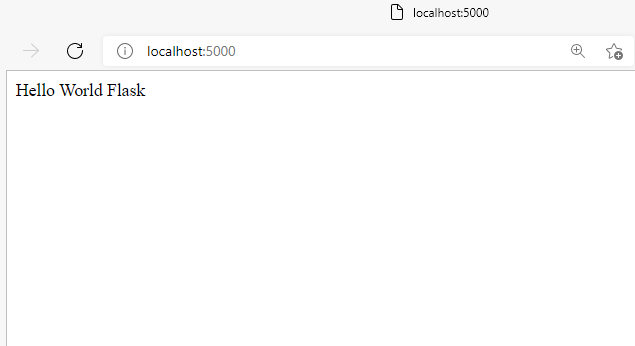

Curso de Flask
---

# Fundamentos de Flask

Flask es sencillo de aprender, tiene una documentación clara y práctica, es rápido a la hora de renderizar puede ser hasta tres veces más rapido que Django. También es fácil de realizar una API REST, la estructura de un proyecto es flexible y es ideal para aprender desarrollo web con un framework de Python.

## ¿Cómo funcionan las aplicaciones de internet?

Cuando utilizas una aplicación web puedes interactuar con ella desde una computadora hasta un dispositivo móvil, pero esto no quiere decir que consume el procesamiento de tu dispositivo. Todo lo contrario, se hace en una red de servidores.

Estos servidores unen su poder de procesamiento con el fin transmitir solicitudes a todo el mundo, a su vez utilizar servidores especializados para almacenar los datos con los cuales se está trabajando, así como los datos de los demás usuarios. Como todo esto sucede sin demora alguna, parecerá que la aplicación se está ejecutando de forma nativa en tu dispositivo.

El servidor procesa la información obtenida por el navegador, luego se realizan los procedimientos necesarios de acuerdo a la lógica de negocio de la aplicación para regresar la información solicitada al cliente.

**Ejemplo:**

Cuando utilizamos Google Drive el cual es una aplicación web y abrimos un documento con Google Docs, el navegador se comunica con los servidores para ver y editar el documento.

A medida que vayas editando el documento, tu navegador trabajará de la mano con los servidores para asegurarse que todos los cambios se estén guardando.

**Ventajas:**

* Muchas de las aplicaciones web que existen son gratuitas.
* Puedes acceder a tu información en cualquier momento y lugar.
* No dependes de un dispositivo en específico ya que la aplicación se encuentra almacenada en la web.

## ¿Qué es Flask?

Flask es un framework minimalista escrito en Python que permite crear aplicaciones web rápidamente y con un mínimo de líneas de código, busca que su infraestructura inicial sea lo más simple posible y pueda personalizarse fácilmente, puedes extender sus funcionalidades con las llamadas Flask Extensions http://flask.pocoo.org/extensions/

Se diferencia de Django porque este tiene una estructura más compleja donde todo lo necesario ya viene incluido incluso aunque en ciertos casos no se necesiten todas las características del framework.

Flask usa un sistema de plantillas llamado Jinja2 que está basado en el sistema de Django Templates

## Instalación de Python, pip y virtualenv

Esta es la guía para configurar nuestro ambiente con Python 3.
Por lo general Mac ya incluye una instalación de Python, la puedes verificar ejecutando los siguientes comandos en una terminal:
```
python --version
python3 --version
```

Debemos asegurarnos de tener python 3. Para instalar Python puedes seguir el siguiente enlace y después regresar a esta lectura.

https://platzi.com/clases/1378-python/14289-guia-de-instalacion-y-conceptos-basicos/

Instalación en Windows
Una vez que instalaste python 3 desde python.org vamos a verificar que también incluimos pip en esta instalación. Después debes correr el siguiente comando para instalar virtualenv:
```
pip install virtualenv
```

El sistema debe haber instalado virtualenv y ahora podemos comenzar con el curso.

Instalación en Mac
Si ya instalaste python 3 ahora corre el siguiente comando para instalar pip:
```
sudo easy_install pip
```
Para install virtualenv de manera global corre:
```
pip install virtualenv
```
El sistema debe haber instalado virtualenv y ahora podemos comenzar con el curso.

## Hello World Flask

Estos son los conceptos principales que debes entender antes de hacer un Hello World en Flask:

* virtualenv: es una herramienta para crear entornos aislados de Python.

* pip: es el instalador de paquetes para Python.

* requirements.txt: es el archivo en donde se colocará todas las dependencias a instalar en nuestra aplicación.

* FLASK_APP: es la variable para identificar el archivo donde se encuentra la aplicación.

Entonces:

* Creamos un ambiente virtual `python -m venv venv`
* Lo activamos `source venv/bin/activate`
* Instalamos flask con pip `pip install flask`
* Creamos archivo que guarda las dependencias a instalar `pip freeze > requeriments.txt`

Ahora ya podemos trabajar en nuestro script. En este:
* Importamos la clase Flask `from flask import Flask`. Esta nos va a permitir crear nuevas instancias de Flask.
* Creamos una nueva instancia y la guardamos en la variable `app`, llamando Flask con el nombre de la apliación `app = Flask(__name__)`

* Ahora se crea una función que va regresar el hello world y se desplegará ligandola con flask, esto se hace con el decorador `@app.route`, esta recibe como parámetro la ruta donde se va a correr la función. 
```
@app.route('/')
def hello():
    return 'Hello World Flask'
```

* Para activar un servidor y correr la aplicación podemos ejecutar el comando `flask run`. No sin antes declarar la variable `FLASK_APP` así `export FLASK_APP=main.py`

* Ya podemos ingresar a la dirección IP del servidor y veremos el mesaje decrito en la función



## Debuggin en Flask

Debugging: es el proceso de identificar y corregir errores de programación.

Para activar el *debug mode* escribir lo siguiente en la consola:
```
export FLASK_DEBUG=1
echo $FLASK_DEBUG
```
Logging: es una grabación secuencial en un archivo o en una base de datos de todos los eventos que afectan a un proceso particular.

Se utiliza en muchos casos distintos, para guardar información sobre la actividad de sistemas variados.

Tal vez su uso más inmediato a nuestras actividades como desarrolladores web sería el logging de accesos al servidor web, que analizado da información del tráfico de nuestro sitio. Cualquier servidor web dispone de logs con los accesos, pero además, suelen disponer de otros logs, por ejemplo, de errores.

Los sistemas operativos también suelen trabajar con logs, por ejemplo para guardar incidencias, errores, accesos de usuarios, etc.

A través de el logs se puede encontrar información para detectar posibles problemas en caso de que no funcione algún sistema como debiera o se haya producido una incidencia de seguridad.

---
Otra opción para correr el servidor en modo debug es poner estas lineas al final del archivo main.py:
```
if __name__ == '__main__':
    app.run(debug=True)
```    
y correr main.py desde la terminal:
```
python main.py 
```

---

**Aporte de comentarios**
Una vez que hayas levantado todo tu servidor a mano, posteriormente lo puedes automatizar así:
```
#!/bin/bash

source venv/bin/activate

export FLASK_APP=main.py
export FLASK_DEBUG=1

flask run
```
1. Copia el código en un nuevo archivo dentro de la raíz de tu proyecto
2. Guarda el archivo con extension .sh
3. Ejecuta desde la consola con el comando: source file_name.sh
4. Listo!, Cada vez que quieras levantar el servidor de Flask solo haz el paso 3

## Request y Response

Flask provee varios tipos de variables que nos brindan el contexto de nuestra aplicación una de ellas es request.

Para ello primero debemos de import request de Flask.

El objeto request tiene varias funciones, una de ellas es detectar la ip en la cual está corriendo la apliación. Esto se define así: `request.remote_addr` y el la función así:
```
@app.route('/')
def index():
    user_ip = request.remote_addr
    return f"Hola Mundo flask, tu IP es: {user_ip}"
```
## Ciclos de Request y Response

Request-Response: es uno de los métodos básicos que usan las computadoras para comunicarse entre sí, en el que la primera computadora envía una solicitud de algunos datos y la segunda responde a la solicitud.

Por lo general, hay una serie de intercambios de este tipo hasta que se envía el mensaje completo.

**Por ejemplo**: navegar por una página web es un ejemplo de comunicación de *request-response*.

*Request-response* se puede ver como una llamada telefónica, en la que se llama a alguien y responde a la llamada; es decir hacemos una petición y recibimos una respuesta.

---
En nuestro codigo creamos una nueva ruta que va a ser la raiz, con la función `index`, y la función hello va a tener la ruta `/hello`

En la funcion index, creamos una respuesta con la ip y la guardamos en una cookie así:
```
@app.route('/')
def index():

    user_ip = request.remote_addr
    make = redirect('/hello')
    response = make_response(make)
    response.set_cookie('user_ip', user_ip)

    return response
```
Ahora con la función hello, obtenemos la ip desde la cookie, así :
```
@app.route('/hello')
def hello():    

    mensaje = 'Hola Mundo!!'
    user_ip = request.cookies.get('user_ip')

    return mensaje + user_ip
```
# Uso de templates y archivos estáticos
## Templates con Jinja 2
Un templeate -> archivo de HTML -> renderiza informacion: Estatica o DInamica -> por variables -> luego nos muestra en el navegador

Para renderizar un template/plantilla creada con Jinja2 simplemente hay que hacer uso del método render_template.

A este método debemos pasarle el nombre de nuestra template y las variables necesarias para su renderizado como parámetros clave-valor.

Flask buscará las plantillas en el directorio templates de nuestro proyecto. En el sistema de ficheros, este directorio se debe encontrar en el mismo nivel en el que hayamos definido nuestra aplicación. En nuestro caso, la aplicación se encuentra en el fichero hello.py.

Es hora de crear este directorio y añadir las páginas hello.html, La estructura de nuestro proyecto quedaría del siguiente modo:
```
Flask-proyect
|_hello.py
|_ /templeate
    |__ hello.html
```
Ejemplo archivo hello.py
```
from flask import Flask, request, make_response, redirect, render_template

app = Flask(__name__)

@app.route('/')
def index():
    user_ip = request.remote_addr
    response = make_response(redirect('/hello_world'))
    response.set_cookie('user_ip', user_ip)

    return response

@app.route('/hello_world')
def hello_world():
    #creamos nueva variable de la ip que detectamos en el browser
    user_ip = request.cookies.get('user_ip')

    return render_template('hello_world.html', user_ip= user_ip)
# metodo es render_template con jinja2 y la variable es user_ip.
```